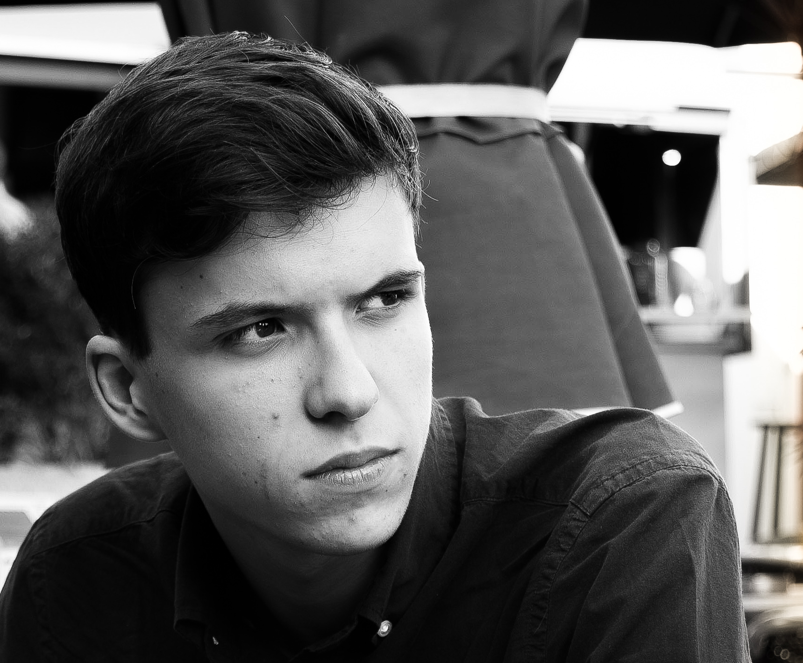

# Multi Media Technology Portfolio - Julian de Moor

**My name is Julian de Moor and I'm a student @ Maastricht Academy of Multi Media Design and Technology, MAMDT Zuyd Hogeschool**

Some of the work I put out over my first year @ MAMDT :
> [Article Website_Project blok1.1](http://student-1846760moor.mamdt.com/11-whole-task/)

> [Datavisualisation Healthcare App_Project blok1.2](http://student-1846760moor.mamdt.com/12-whole-task/)

